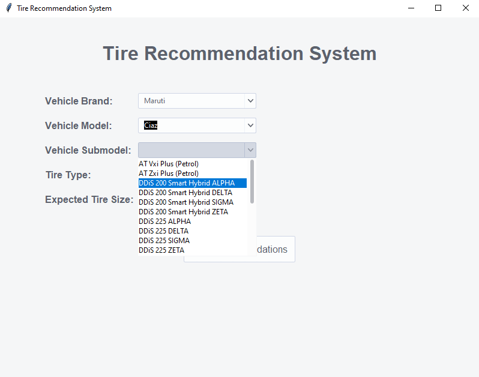
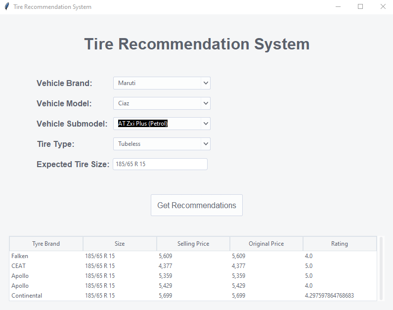

# Tire Recommendation System

## Overview
The **Tire Recommendation System** is a machine learning-based application designed to help vehicle owners and automotive service providers select the most suitable tires based on various parameters. Using a **K-Nearest Neighbors (KNN)** model, the system provides accurate and personalized recommendations based on vehicle specifications, driving conditions, and user preferences.

This project was developed as part of the final project during our **Machine Learning Internship at Feynn Labs**.

## Features
- **Intelligent Tire Recommendations:** Provides recommendations based on vehicle brand, model, submodel, and tire specifications.
- **User-Friendly GUI:** Developed using **Tkinter** with a modern design powered by **ttkthemes**.
- **Data Preprocessing:** Handles missing values and encodes categorical data.
- **KNN Model Implementation:** Finds the best tire match using **nearest neighbors algorithm**.
- **Real-time Search & Filtering:** Users can dynamically select their vehicle details to get recommendations.

## Screenshots



## Technologies Used
- **Python** (Pandas, Scikit-Learn, Tkinter, ttkThemes)
- **Machine Learning:** K-Nearest Neighbors (KNN)
- **Dataset:** Car tire specifications and pricing information

## Installation
### Prerequisites
Ensure you have **Python 3.7+** installed.

### Steps
1. Clone this repository:
   ```sh
   git clone https://github.com/yourusername/tire-recommendation-system.git
   ```
2. Navigate to the project directory:
   ```sh
   cd tire-recommendation-system
   ```
3. Install required dependencies:
   ```sh
   pip install -r requirements.txt
   ```
4. Run the application:
   ```sh
   python modern-gui.py
   ```

## How It Works
1. **Select Vehicle Brand, Model, and Submodel**
2. **Choose Tire Type (Tubeless/Tube)**
3. **Enter Expected Tire Size** (or let the system auto-suggest)
4. **Click 'Get Recommendations'**
5. **View Top Recommended Tires** with details like price, size, and brand

## Project Structure
```
├── modern-gui.py             # Main GUI application
├── Car_Tyres_Dataset.csv     # Dataset used for training
├── requirements.txt          # Required dependencies
├── README.md                 # Project documentation
└── screenshots/              # Folder containing UI screenshots
```


## Team Members
- **[@prabhjot-singh-virdi](https://github.com/prabhjot-singh-virdi)** *(Team Lead & Model Development)*
- **[@jaffer-sulaiman](https://github.com/jaffer-sulaiman)** *(Data Preprocessing & GUI Implementation)*
- **Suryakant** *(Feature Engineering & Testing)*
- **Stephenca** *(Feature Engineering & Testing)*


## Acknowledgments
This project was part of our **Machine Learning Internship at Feynn Labs**. Special thanks to **Feynn Labs AI Incubator** for their guidance and mentorship.

## License
This project is licensed under the **MIT License**.

## Contact
For queries or contributions, feel free to reach out to any of the team members.

